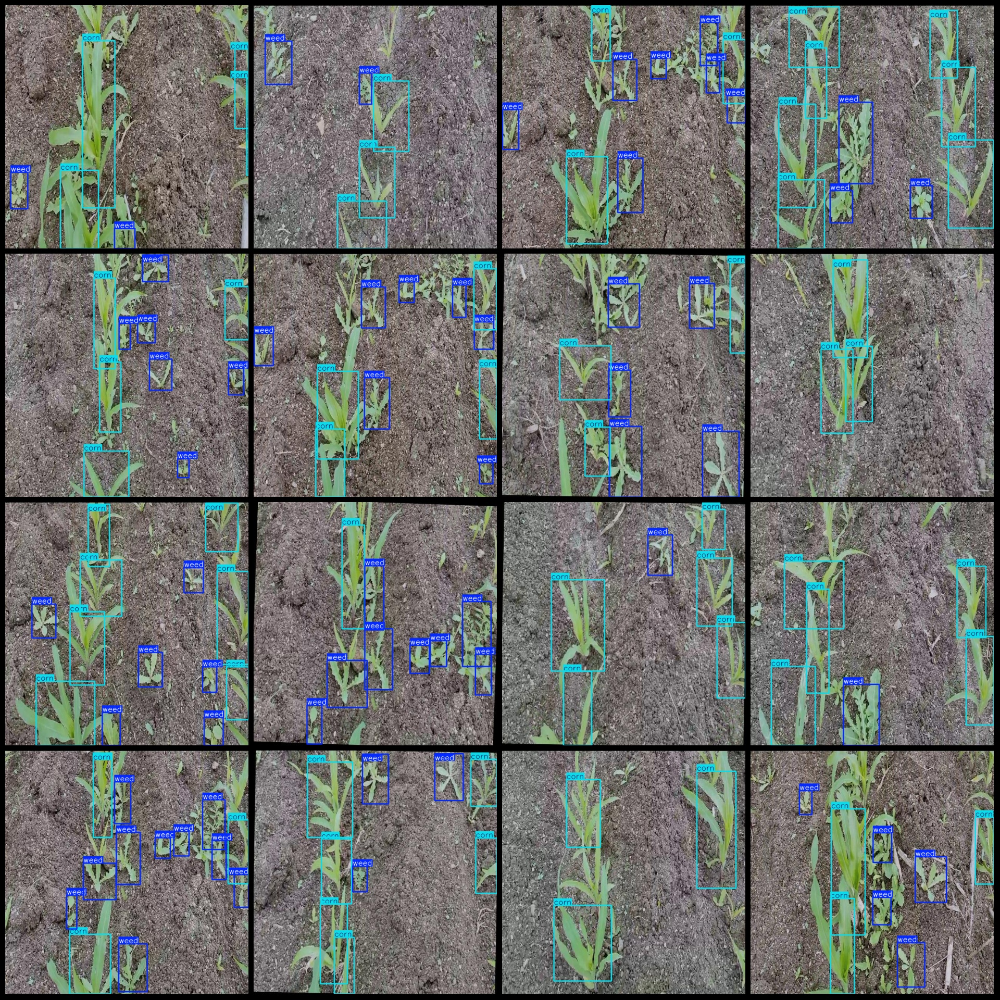
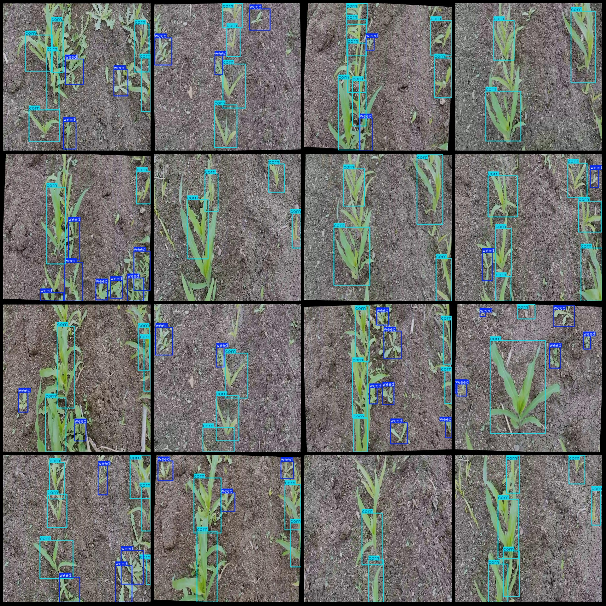

# Intelligent Agriculture Corn and Weed Detection Dataset VOC+YOLO Format with 697 Images in 2 Categories

Dataset format: Pascal VOC format + YOLO format (txt files without split paths, only containing JPG images along with corresponding VOC format xml files and YOLO format txt files)
Number of images (JPG file count): 697
Number of annotations (xml file count): 697
Number of annotations (txt file count): 697
Number of annotation categories: 2
Annotation category names (Note that the order of categories in the YOLO format does not correspond to this, but is based on the 'classes.txt' file in the labels folder): ["corn", "weed"]
Number of boxes for each category:
- Corn (corn) boxes = 2781
- Weed (weed) boxes = 2686
Total number of boxes: 5467
Image resolution: 640x640
Annotation tool used: labelImg
Annotation rules: draw bounding boxes for each category
Important note: The dataset does not have a training validation test split; you must manually divide it.
Special declaration: This dataset does not guarantee the accuracy of trained models or weight files.
Image preview:
Annotation example

## Images

Here is a pay link on Stripe ( https://buy.stripe.com/3cs8yP7sY87d0vu9AB ). Please contact me lonlonago@foxmail.com after funding $89, and I will send you a complete data files , thank you!

